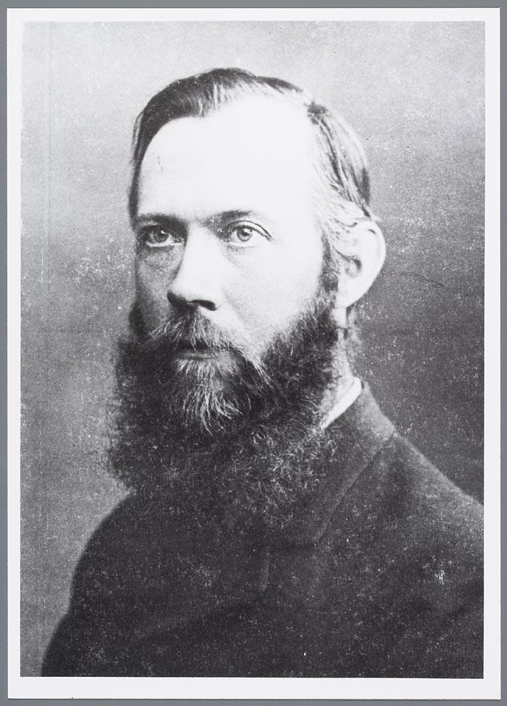
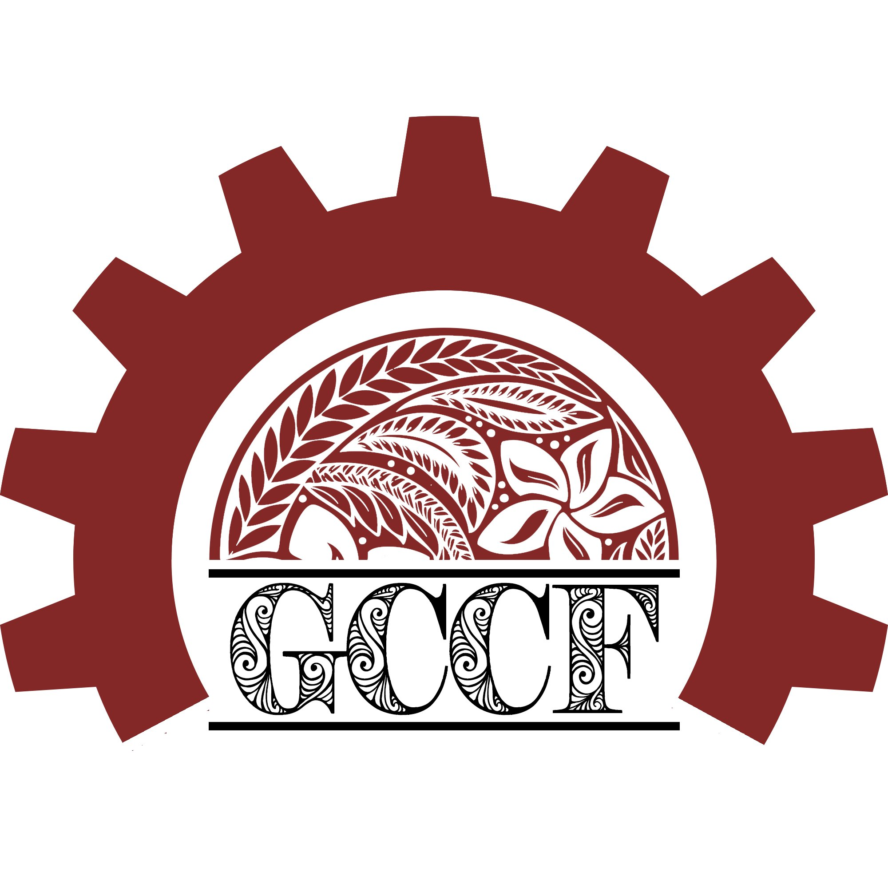
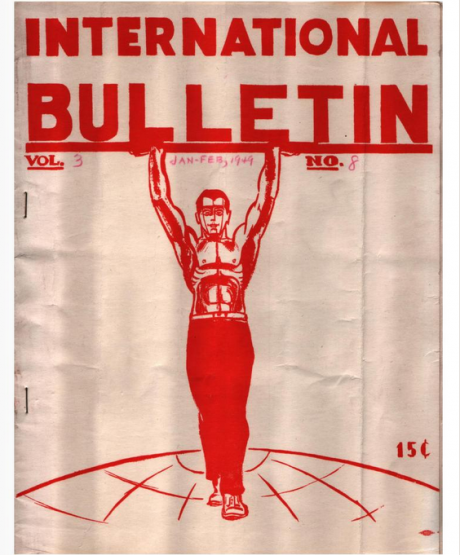
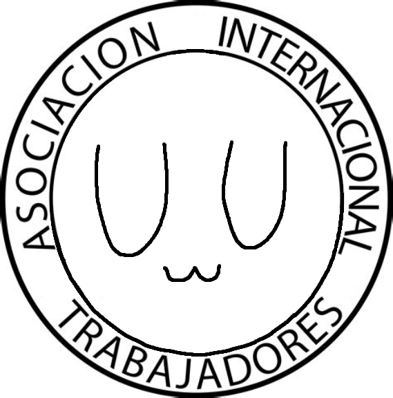
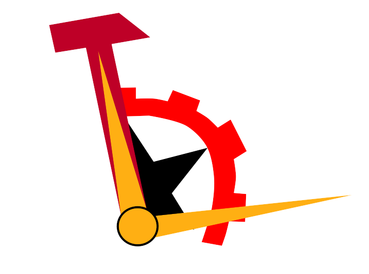

# ★☭★ Maddie's Theory Reading List ★☭★

## Table of Contents

* [Introduction by Zoomer Nation](#introduction-by-zoomer-nation)
* [Essential Writings](#essential-writings)
  1. [Marxist Internet Archives' "Short List for beginners"](#marxist-internet-archives-short-list-for-beginners)
  2. [Other Marx and Engels](#other-marx-and-engels)
  3. [Lenin](#lenin)
  4. [Luxemburg](#luxemburg)
  5. [Bordiga](#bordiga)
  6. [Damen](#damen)
  7. [Pannekoek](#pannekoek)
  8. [Internationalist Communist Tendency](#internationalist-communist-tendency)
* [Non-Essential Writings](#non-essential-writings)
  1. [Marx and Engels](#other-marx-and-engels)
  2. [Lenin](#lenin)
  3. [Bordiga](#bordiga)
  4. [Damen](#damen)
  5. [Pannekoek](#pannekoek)
  6. [Internationalist Communist Tendency](#internationalist-communist-tendency)
  2. [International Communist Current](#international-communist-current)
  3. [Gulf Coast Communist Fraction](#gulf-coast-communist-fraction)
  4. [Internationalist Communist Group](#internationalist-communist-group)
  5. [American Fraction of the International Communist Left](#american-fraction-of-the-international-communist-left)
  6. [Single Works](#single-works)
* [Miscellaneous](#miscellaneous)
  1. [Comparisons of the Positions of Various Left-Communist Groups](#comparisons-of-the-positions-of-various-left-communist-groups)
  2. [Images](#images)

## Introduction by Zoomer Nation

Here is a collection of writings from Marxist theoreticians ranging from various time periods which assist in fully developing an Marxist outlook and conception of theory. The writings stem from various ideological variants all under the umbrella of revolutionary Marxism. The list includes writings from the foundational Marxist theoreticians along with organizational writings which developed under their inspiration. If new theoretical writings need to be added, the list will change in accordance.

# Essential Writings:

## Marxist Internet Archives' "Short List for beginners":

* 1845: Theses on Feuerbach by Karl Marx

Read this Marx work [here.](./Contents/theses-on-feuerbach.pdf)
* 1846: The German Ideology by Karl Marx

Read this Marx work [here.](./Contents/german-ideology.pdf)
* 1847: Principles of Communism by Friedrich Engels

Read this Engels work [here.](./Contents/principles-of-communism.pdf)
* 1848: The Communist Manifesto by Karl Marx

Read this Marx work [here.](./Contents/communist-manifesto.pdf)
* 1849: Wage-Labour and Capital by Karl Marx

Read this Marx work [here.](./Contents/wage-labour-capital.pdf)
* 1859: A Contribution to the Critique of Political Economy (Preface) by Karl Marx

Read this Marx work [here.](./Contents/contribution-to-the-critique-of-political-economy-preface.pdf)
* 1867: Capital (Chapter One) by Karl Marx

Read this Marx work [here.](./Contents/capital-chapter-1.pdf)
* 1871: The Civil War in France by Karl Marx

Read this Marx work [here.](./Contents/civil-war-france.pdf)
* 1875: Critique of the Gotha Programme by Karl Marx

Read this Marx work [here.](./Contents/gothakritik.pdf)
* 1880: Socialism: Utopian and Scientific by Friedrich Engels

Read this Engels work [here.](./Contents/socialism-utopian-and-scientific.pdf)
* 1886: Ludwig Feuerbach and the End of Classical German Philosophy by Friedrich Engels

Read this Engels work [here.](./Contents/ludwig-feuerbach.pdf)

## Other Marx and Engels:

* 1844: Origin of the Family, Private Property, and the State by Friedrich Engels

Read this Engels work [here.](./Contents/origin-of-the-family.pdf)
* 1844: Paris Manuscripts by Karl Marx

Read this Marx work [here.](./Contents/paris-manuscripts.pdf)
* 1852: The Eighteenth Brumaire of Louis Bonaparte

Read this Marx work [here.](./Contents/18-brumaire-of-louis-bonaparte.pdf)

## Lenin:

* 1917: Imperialism: The Highest Stage of Capitalism

Read this Lenin work [here.](./Contents/imperialism.pdf)
* 1918: State and Revolution

Read this Lenin work [here.](./Contents/state-and-revolution.pdf)

## Luxemburg

* 1899: Reform or Revolution?

Read this Luxemburg work [here.](./Contents/reform-or-revolution.pdf)
* 1909: The National Question

Read this Luxemburg work [here.](./Contents/national-question.pdf)
* 1915: The Junius Pamphlet

Read this Luxemburg work [here.](./Contents/junius-pamphlet.pdf)

## Bordiga:

* 1919: The System of Communist Representation

Read this Bordiga work [here.](./Contents/system-of-communist-representation.pdf)
* 1921: Party and Class

Read this Bordiga work [here.](./Contents/party-and-class.pdf)
* 1922: The Democratic Principle

Read this Bordiga work [here.](./Contents/democratic-principle.pdf)
* 1926: The Lyons Theses

Read this Bordiga work [here.](./Contents/lyons-theses.pdf)
* 1952: Dialogue with Stalin

Read this Bordiga work [here.](./Contents/dialogue-with-stalin.pdf)
* 1952: The Human Species and the Earth's Crust

Read this Bordiga work [here.](./Contents/human-species-and-the-earths-crust.pdf)
* 1957: Fundamentals of Revolutionary Communism

Read this Bordiga work [here.](./Contents/fundamentals-of-revolutionary-communism.pdf)

## Damen:

* 1946: Bourgeois Violence and Proletarian Defence

Read this Damen work [here.](./Contents/bourgeois-violence.pdf)
* 1951: Centralized Party? Yes. Centralism over the Party? No!

Read this Damen work [here.](./Contents/centralized-party.pdf)
* 1952: Points of Disagreement with the 1952 "Platform" Drafted by Bordiga

Read this Damen work [here.](./Contents/points-of-disagreement.pdf)
* 1952: Five Letters and an Outline of the Disagreement

Read this Damen work [here.](./Contents/five-letters-and-an-outline-of-disagreement.pdf)
* 1970: Amadeo Bordiga – Beyond the Myth and the Rhetoric

Read this Damen work [here.](./Contents/bordiga-beyond-the-myth.pdf)

## Pannekoek

* 1936: Trade Unionism

Read this work [here.](./Contents/trade-unionism.pdf)

## Internationalist Communist Tendency:

* 1925: Platform of the Committee of Intesa

Read this ICT work [here.](./Contents/platform-of-the-committee-of-intesa.pdf)
* 1994: Socialism or Barbarism

Read this ICT work [here.](./Contents/socialism-or-barbarism.pdf)
* 2018: Class Consciousness and Revolutionary Organisation

Read this ICT work [here.](./Contents/class-consciousness-and-revolutionary-organisation.pdf)
* 2019: For Communism

Read this ICT work [here.](./Contents/for-communism.pdf)
* 2020: Platform of the Internationalist Communist Tendency

Read this ICT work [here.](./Contents/ict-platform.pdf)

## International Communist Current:

* 2004: Platform of the ICC

Read this ICC work [here.](./Contents/icc-platform.pdf)
* 2005: The Communist-Left and the Continuity of Marxism

Read this ICC work [here.](./Contents/communist-left-and-continuity-of-marxism.pdf)
* 2007: Basic Positions of the ICC

Read this ICC work [here.](./Contents/icc-positions.pdf)
* 2010: The Communist-Left and Internationalist Anarchism

Read part one of this ICC work [here.](./Contents/communist-left-and-internationalist-anarchism-1.pdf)

Read part two of this ICC work [here.](./Contents/communist-left-and-internationalist-anarchism-2.pdf)

Read part three of this ICC work [here.](./Contents/communist-left-and-internationalist-anarchism-3.pdf)

## Internationalist Communist Group

* ????: Theses of Programmatical Orientation

Read this ICG work [here.](./Contents/theses-of-programmatical-orientation.pdf)
* ????: Communism Against Democracy

Read this ICG work [here.](./Contents/communism-against-democracy.pdf)

# Non-Essential Writings:

## Marx and Engels:

* 1872: The Housing Question by Friedrich Engels

Read this Engels work [here.](./Contents/housing-question.pdf)
* 1872: On Authority by Friedrich Engels

Read this Engels work [here.](./Contents/on-authority.pdf)
* 1874: Conspectus of Bakunin’s Statism and Anarchy by Karl Marx

Read this Marx work [here.](./Contents/conspectus-of-bakunins-statism-and-anarchy.pdf)

## Lenin:

* 1920: "Left-Wing" Communism: an Infantile Disorder

Read this Lenin work [here.](./Contents/left-wing-communism-infantile-disorder.pdf)

## Bordiga:

* 1921: Party and Class Action

Read this Bordiga work [here.](./Contents/party-and-class-action.pdf)
* 1951: Doctrine of the Body Possessed by the Devil

Read this Bordiga work [here.](./Contents/doctrine-of-the-body-possessed-by-the-devil.pdf)
* 1952: Activism

Read this Bordiga work [here.](./Contents/activism.pdf)
* 1953: The Spirit of Horsepower

Read this Bordiga work [here.](./Contents/spirit-of-horsepower.pdf)

## Damen:

* 1972: You Can't Build the Party Playing with Paradoxes

Read this Damen work [here.](./Contents/you-can't-build-the-party-playing-with-paradoxes.pdf)

## Pannekoek

* 1913: Socialism and Anarchism

Read this work [here.](./Contents/socialism-and-anarchism.pdf)
* 1948: Anarchism not Suitable

Read this work [here.](./Contents/anarchism-not-suitable.pdf)

## Internationalist Communist Tendency:

* 2000: Trotsky and the Internationalist Communist Left

Read this ICT work [here.](./Contents/trotsky-and-the-internationalist-communist-left.pdf)
* 2005: The Communist Manifesto of 1875 - The Critique of the Gotha Programme

Read this ICT work [here.](./Contents/communist-manifesto-of-1875-gothakritik.pdf)
* 2010: The National Question Today and the Poisonous Legacy of the Counter-revolution

Read this ICT work [here.](./Contents/national-question-today-and-the-poisonous-legacy-of-the-counter-revolution)
* 2011: Capitalism and the Environment

Read this ICT work [here.](./Contents/capitalism-and-the-environment.pdf)
* 2015: Every Vote Is a Yes For Capitalism

Read this ICT work [here.](./Contents/every-vote-is-a-yes-for-capitalism.pdf)
* 2016: Against All Nationalisms

Read this ICT work [here.](./Contents/against-all-nationalisms.pdf)
* 2016: The Party Question

Read this ICT work [here.](./Contents/party-question.pdf)

## International Communist Current:

* 1992: Balance Sheet of 70 Years of "National Liberation" Struggles

Read part one of this ICC work [here.](./Contents/balance-sheet-of-70-years-of-national-liberation-struggles-1.pdf)

Read part two of this ICC work [here.](./Contents/balance-sheet-of-70-years-of-national-liberation-struggles-2.pdf)

Read part three of this ICC work [here.](./Contents/balance-sheet-of-70-years-of-national-liberation-struggles-3.pdf)
* 2004: Perspective of Communism

Read part one of this ICC work [here.](./Contents/perspective-of-communism-1.pdf)

Read part two of this ICC work [here.](./Contents/perspective-of-communism-2.pdf)

Read part three of this ICC work [here.](./Contents/perspective-of-communism-3.pdf)

Read part four of this ICC work [here.](./Contents/perspective-of-communism-4.pdf)
* 2005: Unions Against the Working Class

Read this ICC work [here.](./Contents/unions-against-the-working-class.pdf)
* 2009: What Distinguishes Revolutionaries From Trotskyism?

Read this ICC work [here.](./Contents/what-distinguishes-revolutionaries-from-trotskyism.pdf)

## Gulf Coast Communist Fraction:

* 2018: Benjamin Peret on the History of Unions

Read this GCCF work [here.](./Contents/history-of-unions.pdf)
* 2019: Points of Unity

Read this GCCF work [here.](./Contents/gccf-points-of-unity.pdf)
* 2020: Anti-Police Brutality Protests in the United States: Political Implications and Perspectives for the Working Class

Read this GCCF work [here.](./Contents/anti-police-brutality.pdf)
* 2020: USA: Lessons from the Teachers’ Struggle: Left-Racialism as a Tool of Union-Sabotage

Read this GCCF work [here.](./Contents/left-racialism.pdf)

## Internationalist Communist Group

* 1979: Communism Against Democracy: Theses

Read this ICG work [here.](./Contents/communism-against-democracy-theses.pdf)
* ????: Human Activity Against Labour

Read this ICG work [here.](./Contents/human-activity-against-labour.pdf)

## American Fraction of the International Communist Left

* 1948: Capitalist Democracy: a Contrast Between the Position of Lenin and that of Trotsky

Read this AFICL work [here.](./Contents/capitalist-democracy.pdf)
* 1949: What We Stand For

Read this AFICL work [here.](./Contents/aflci-what-we-stand-for.pdf)
* 1949: Aspects of the Russian Question

Read this AFICL work [here.](./Contents/aspects-of-the-russian-question.pdf)

## Single Works:

* 1917: Imperialism and World Economy by Nikolai Bukharin

Read this work [here.](./Contents/imperialism-and-world-economy.pdf)
* 1921: Manifesto of the German Anti Parliamentarians to the Proletariat of the World by the Communist Workers' Party of Germany/KAPD

Read this work [here.](./Contents/kapd-manifesto.pdf)
* 1934: Anti-Fascism: Formula for Confusion by Bilan

Read this work [here.](./Contents/anti-fascism-formula-for-confusion.pdf)
* 1967: The Society of the Spectacle by Guy Debord

Read this work [here.](./Contents/society-of-the-spectacle.pdf)
* 1968: Notes on Democratic Centralism by Tony Cliff

Read this work [here.](./Contents/notes-on-democratic_centralism.pdf)
* 1993: Against Democracy by Wildcat

Read this work [here.](./Contents/against-democracy.pdf)
* ????: Notes on Democracy by Against Sleep and Nightmare

Read this work [here.](./Contents/notes-on-democracy.pdf)
* 2002: The Amsterdam Declaration by Humanist International

Read this work [here.](./Contents/amsterdam-declaration.pdf)
* 2009: Capitalist Realism: Is There No Alternative? by Mark Fisher

Read this work [here.](./Contents/capitalist-realism.pdf)
* 2013: “The Real Enemy?” Why We Should Reject Left Unity as a Concept by Phil Dickens

Read this work [here.](./Contents/why-we-should-reject-left-unity-as-a-concept.pdf)
* 2014: Unity for What and With Whom? A Polemic Against Left Unity by Scott Nappalos

Read this work [here.](./Contents/unity-for-what-and-with-whom.pdf)
* 2014: Communism is the Ascension of Humanity as the Subject of History: A Critique of Althusser and the Affirmation of Marx

Read this work [here.](./Contents/communism-is-the-ascension-of-humanity-as-the-subject-of-history.pdf)
* 2020: Manifesto of the International Communist Workers' Party

Read this work [here.](./Contents/icwp-manifesto.pdf)

# Miscellaneous:

## Comparisons of the Positions of Various Left-Communist Groups

| Position | ICT | ICC | GCCF | AFICL |
| ----------- | ----------- | ----------- | ----------- | ----------- |
| Pro-DotP | Title | ----------- | ----------- | ----------- |
| Pro-Internationalism | Text | ----------- | ----------- | ----------- |
| Pro-DotP | Title | ----------- | ----------- | ----------- |
| Pro-Internationalism | Text | ----------- | ----------- | ----------- |

## Images:

### Left-Communist

### Humanist

