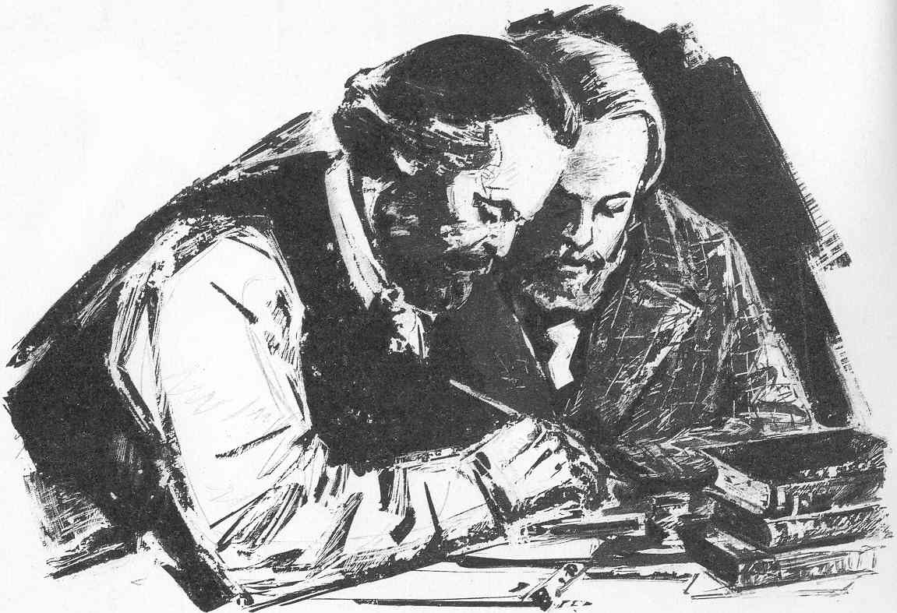

# ★☭★ Maddie's Personal Theory Reading List ★☭★

## Table of Contents

1. [Introduction](#introduction)
2. [Marxist Internet Archive's "Short List for Beginners"](#marxist-internet-archives-short-list-for-beginners)
3. [Lenin](#lenin)
4. [Bordiga](#bordiga)
5. [Damen](#damen)
6. [Internationalist Communist Tendency](#internationalist-communist-tendency)
7. [International Communist Current](#international-communist-current)
8. [Single Works](#single-works)
9. [Images](#images)

## Introduction

## Marxist Internet Archive's "Short List for Beginners":

* 1845: Theses on Feuerbach by Karl Marx
* 1849: Wage-Labor and Capital by Karl Marx
* 1846: The German Ideology by Karl Marx
* 1847: Principles of Communism by Friedrich Engels
* 1848: The Communist Manifesto by Karl Marx
* 1859: A Contribution to the Critique of Political Economy (Preface) by Karl Marx
* 1867: Capital (Chapter One) by Karl Marx
* 1871: The Civil War in France by Karl Marx
* 1875: Critique of the Gotha Programme by Karl Marx
* 1880: Socialism: Utopian and Scientific by Friedrich Engels
* 1886: Ludwig Feuerbach and the End of Classical German Philosophy by Friedrich Engels

## Lenin:

* 1902: What Is To Be Done?
* 1917: Imperialism: The Highest Stage of Capitalism
* 1918: State and Revolution

## Bordiga:

* 1919: The System of Communist Representation
* 1921: Party and Class
* 1922: The Democratic Principle
* 1926: The Lyons Theses
* 1952: Activism
* 1952: Dialogue with Stalin
* 1952: The Human Species and the Earth's Crust
* 1957: Fundamentals of Revolutionary Communism

## Damen:

* 1946: Bourgeois Violence and Proletarian Defence
* 1951: Centralized Party? Yes. Centralism over the Party? No!
* 1952: Points of Disagreement with the 1952 "Platform" Drafted by Bordiga
* 1952: Five Letters and an Outline of the Disagreement

## Internationalist Communist Tendency:

* 2005: The Communist Manifesto of 1875 - The Critique of the Gotha Programme
* 2019: For Communism
* 2020: Platform of the Internationalist Communist Tendency

## International Communist Current:

* 2004: Platform of the International Communist Current
* 2005: The Communist-Left and the Continuity of Marxism
* 2005: Perspective of Communism

## Single Works:

* 1921: Manifesto of the German Anti Parliamentarians to the Proletariat of the World by the Communist Workers' Party of Germany/KAPD
* 1934: Anti-Fascism: Formula for Confusion by Bilan
* 1936: Trade Unionism by Anton Pannekoek
* 1967: The Society of the Spectacle by Guy Debord
* 1968: Notes on Democratic Centralism by Tony Cliff
* 1993: Against Democracy by Wildcat
* 2002: The Amsterdam Declaration by Humanist International
  1. **Humanism is ethical.** It affirms the worth, dignity and autonomy of the individual and the right of every human being to the greatest possible freedom compatible with the rights of others. Humanists have a duty of care to all of humanity including future generations. Humanists believe that morality is an intrinsic part of human nature based on understanding and a concern for others, needing no external sanction.
  2. **Humanism is rational.** It seeks to use science creatively, not destructively. Humanists believe that the solutions to the world’s problems lie in human thought and action rather than divine intervention. Humanism advocates the application of the methods of science and free inquiry to the problems of human welfare. But Humanists also believe that the application of science and technology must be tempered by human values. Science gives us the means but human values must propose the ends.
  3. **Humanism supports democracy and human rights.** Humanism aims at the fullest possible development of every human being. It holds that democracy and human development are matters of right. The principles of democracy and human rights can be applied to many human relationships and are not restricted to methods of government.
  4. **Humanism insists that personal liberty must be combined with social responsibility.** Humanism ventures to build a world on the idea of the free person responsible to society, and recognises our dependence on and responsibility for the natural world. Humanism is undogmatic, imposing no creed upon its adherents. It is thus committed to education free from indoctrination.
  5. **Humanism is a response to the widespread demand for an alternative to dogmatic religion.** The world’s major religions claim to be based on revelations fixed for all time, and many seek to impose their world-views on all of humanity. Humanism recognises that reliable knowledge of the world and ourselves arises through a continuing process of observation, evaluation and revision.
  6. **Humanism values artistic creativity and imagination** and recognises the transforming power of art. Humanism affirms the importance of literature, music, and the visual and performing arts for personal development and fulfilment.
  7. **Humanism is a lifestance aiming at the maximum possible fulfilment** through the cultivation of ethical and creative living and offers an ethical and rational means of addressing the challenges of our times. Humanism can be a way of life for everyone everywhere.

* 2009: Capitalist Realism: Is There No Alternative? by Mark Fisher

## Images:

### Left-Communist

### Humanist

